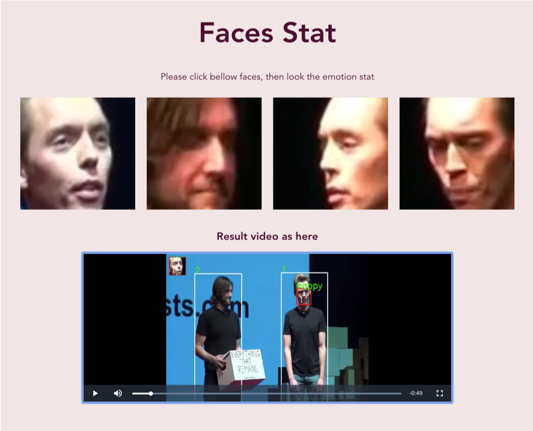
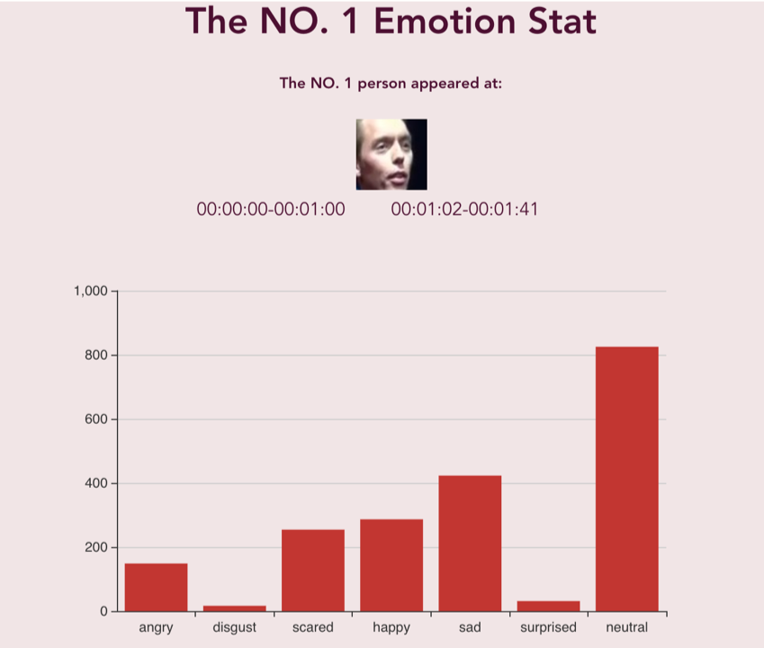

# Facial Expression Recognition

#### 1. Download model

https://drive.google.com/open?id=1BhKRwCX2g96LTiGAm3VtsnnFAYJnUF9J

Please down this file at ./src/model/face_recognition/yolo3/

#### 2. Install python package

At first, you need install these package, as bellow:

 `pip install -r requirements.txt `

Requirements includes:

django
numpy
pandas
opencv-python
Pillow
tensorflow
keras
scipy

#### 3. Running at servers

After you put the code on your servers by ssh, and at your computer, please run the bellow code:

`ssh -L 8888:127.0.0.1:8000 username@serveraddress.com`

Next step, on your computer browser, input the address
http://localhost:8888/demo , the page look like:

You can upload your video, and click 'Calculate' button to run this model. When the running is finish, the result page look like:

There are each detected face and result video in the result summary page, and you can click each face go to the face stat page, look like:

There are this face detected time, and emotion data summary chart at that, and each frame detail data you can download from your servers file path is `./static/result/data/`. 

#### 4. In the own computer

If you want to run the application at your own computer, you need run this code:

`./demo_for_local.sh your_video_path`

The result file path is `./static/result/`

